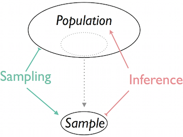

# Chapter 6: Descriptive Statistics

### This is a review of descriptive statistics concepts, very useful to summarize data. The next chapter will focus on inferential statistics, but a first approach is offered here with confidence intervals.

## Learning Objectives

- Describing data and Sampling
  - Mean, median, mode
  - Range, Interquartile range (IQR), outliers
  - Population variance and standard deviation
  - Sample variance and standard deviation

- Estimation
  - Confidence interval, point estimator and margin of error
  - Estimating of a population proportion
  - Estimating of a population mean

Python modules: `numpy` and `scipy.stats`

## Main Resources

A [short review](resources/statistics_review.md) is available to go over the main definitions you will need.

## Assignments
The aim of this chapter is to
  1. implement functions to calculate some basic statistics
  2. use `scipy` and `numpy` functionalities

### 1. Summary statistics

* [Assignment 1:](assignments/assignment_1_summary_stats.md) In this assignment, you will be developing working with the 3 Ms (Mean, median, mode). We also take a quick look at ways to measure the spread of datasets and identify outliers. Fill in the functions in [assignment_1_summary_stats.py](code/assignment_1_summary_stats.py) and answer the questions in [assignment_1_summary_stats.md](assignments/assignment_1_summary_stats.md).

### 2. Sampling

* [Assignment 2:](assignments/assignment_2_sampling.md) We will be drawing samples of various size from a population and computing summary statistics to understand the differences in computing values for a population vs for a sample. Make sure you understand how to load the data (`load_pickle` function) and fill in the functions in [assignment_2_sampling.py](code/assignment_2_sampling.py). Answer further questions in the [assignment_2_sampling.md](assignments/assignment_2_sampling.md).

### 3. Estimation

* [Assignment 3:](assignments/assignment_3_estimation.md) Let us take a first look at inference, i.e. getting to estimates of population parameters from sample statistics. We will be estimating population proportions and means thanks to confidence intervals. Answer the questions in [assignment_3_estimation.md](assignments/assignment_3_estimation.md) and fill in [assignment_3_sampling.py](code/assignment_3_sampling.py) when appropriate.

## Recap

Remember, no matter how useful summary statistics are, they can only capture facets of the data. Choose wisely and don't forget to visualize your data to better understand its structure.

To obtain estimates of population parameters, which are often out of our reach, we rely on sampling and inference techniques.

&nbsp;&nbsp;&nbsp;&nbsp;

## Going Further: More resources

Khan Academy offers a very nice statistics course online for free: https://www.khanacademy.org/math/statistics-probability

This is a very shallow dive into the world of sampling and estimation. Do not hesitate to check out topics such as
- simple random sampling vs systematic sampling, stratified sampling or clustered sampling.
- parameter estimation techniques (MLE, but also MOM or MAP)
