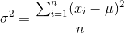
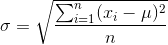
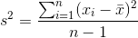
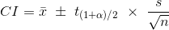
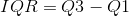
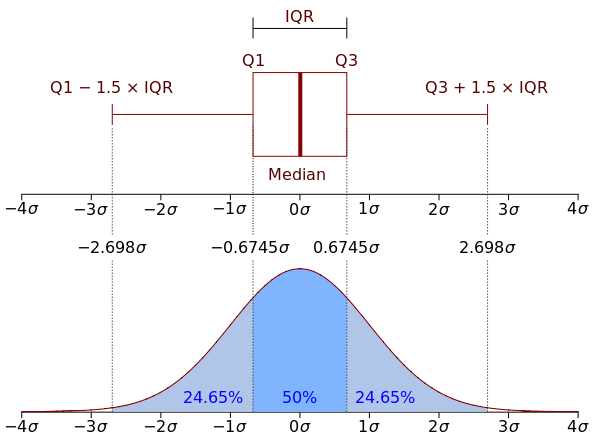

##Statistics Review

###Population mean

&nbsp;&nbsp;&nbsp;&nbsp;
- Mean value of the whole population
- Usually the true value is unknown
- A value is hypothesized

###Population variance

&nbsp;&nbsp;&nbsp;&nbsp;
- The spread of the population
- Usually the true value is unknown
- A value is hypothesized

###Standard deviation

&nbsp;&nbsp;&nbsp;&nbsp;
- Square root of population variance

###Sample mean

&nbsp;&nbsp;&nbsp;&nbsp;
- Mean value of a sample from the population

###Sample variance

&nbsp;&nbsp;&nbsp;&nbsp;
- Mean spread of a sample from the population

###Confidence interval

&nbsp;&nbsp;&nbsp;&nbsp;
- **s** is the sample standard deviation (square root of sample variance)
- <b>t(1+alpha)/2</b> is the t-score at a certain confidence level
in a t-distribution
**(e.g. 1.96 at 95% confidence)**
- You can be 95% sure that the 95% CI includes the true population value
- Conversely if a value is outside of the 95% CI, you can be 95% sure that it is
outside of the range of the population value
- Usually we consider 95% confidence interval to be statistically significant

###Interquartile range

&nbsp;&nbsp;&nbsp;&nbsp;
- Q1 is the value at the 25th percentile of the distribution
- Q3 is the value at the 75th percentile of the distribution
- The range in the mid-fifty percent of the distribution of values
(See below)

- IQR has a similar interpretation as standard deviation
- IQR is less affected by the presence of extreme values compared to standard
deviation
